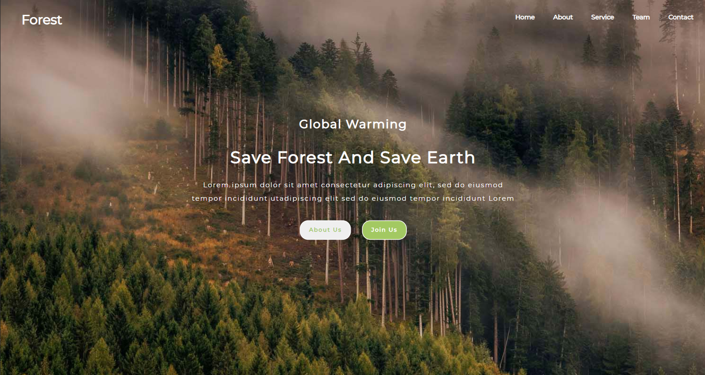
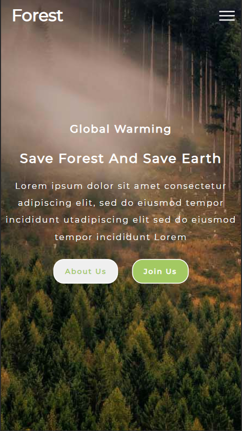

<!-- Please update value in the {}  -->

<h1 align="center">FOREST</h1>

   Solution for a layout from  <a href="https://w3layouts.com/" target="_blank">w3layouts</a>.

  <h3>
    <a href="https://distracted-sinoussi-3331bb.netlify.app/" >
      Demo
    </a>
     | 
    <a href="https://github.com/prasannakarki77/forest" >
      Solution
    </a>
     | 
    <a href="https://w3layouts.com/template/forest-a-society-category-bootstrap-responsive-web-template/" >
      Design
    </a>
  </h3>

<!-- TABLE OF CONTENTS -->

## Table of Contents

- [Overview](#overview)
  - [Built With](#built-with)
- [Contact](#contact)

<!-- OVERVIEW -->

## Overview
DESKTOP 

MOBILE

### Built With

<!-- This section should list any major frameworks that you built your project using. Here are a few examples.-->

- HTML
- CSS
- JS

## Contact

- Website [prasannakarki77-website.com](https://compassionate-lichterman-26c523.netlify.app/)
- GitHub [@prasannakarki77](https://github.com/prasannakarki77)
- Twitter [@PrkKarkee-twitter](https://twitter.com/PrkKarkee)
